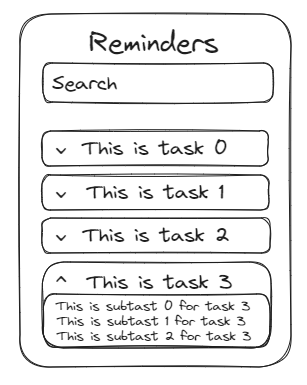

# Project (to-do app)

## Initial design sketches (see page 10 for example)
- Include annotated initial design sketches of your program’s user interface. Sketches 
should illustrate the layout of your screens, UI elements, and navigation between 
screens. Note: these are initial sketches and the user interface will be refined during 
the Planning and Designing stage of the software development cycle (minimum 1 
page).

## Project pitch presentation

- Present your project idea as a ‘pitch’ to the class. The pitch should engage the audience, aim to “sell” the design and persuade the audience that the idea is worth buying or investing in. Your pitch must clearly communicate:
  - the problem or need you have chosen to solve
    - Missing homework and assements because there is no structure
    - No single source (creates structure)
      - Popular project management software is typically accessed as a web app - and requires log in - I would rather open up a native desktop app (much quicker and more secure)
    - [Backlog] No notifications
      - Create push notifications
  - explanation of the software solution idea
    - (to-do app)
  - features and functionality offered
    - A single desktop app
    - Push notifications (`node-notifier`)
    - Allow multiple parallel tasks
      - Title
      - Description
      - Due date (time)
      - Subtasks
        - Title
        - Description
        - Due date (time)
        - Option to opt out of push notifications for this tasks subtasks
  - project goals and intentions
    - To become more organised
    - To make orgnaising simpler/faster
  - initial design ideas (neat sketches or wireframes)
    
  - Feasibility of the solution.
    -
- Your pitch can be presented in person (using Google Slides or Microsoft PowerPoint) or in the form of a video submission, voice-over slides, or screencast if you prefer.
